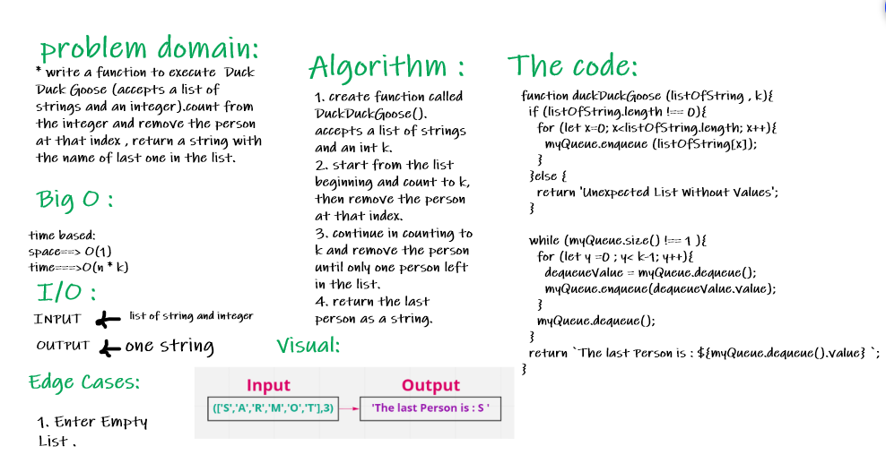
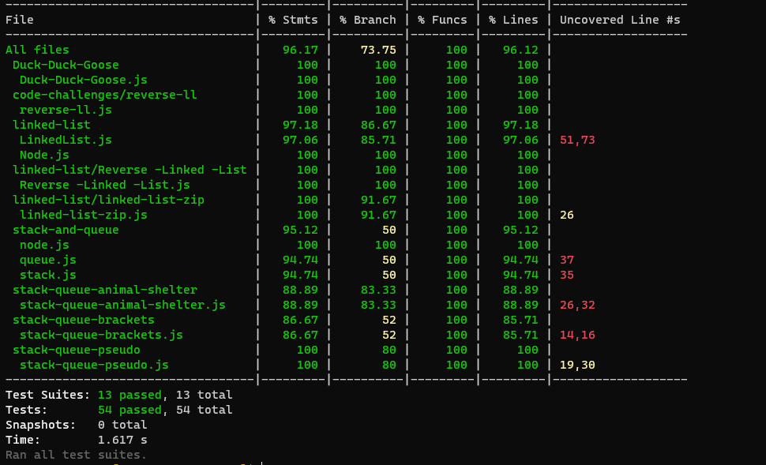

# ]Duck-Duck-Goose :

### Challenge : 

   * write a function to execute  Duck Duck Goose (accepts a list of strings and an integer).count from the integer and remove the person at that index , return a string with the name of last one in the list.

### Approach and Efficiency :

  * space : O(1)
  * time : O(n * k)

### API :

 *  duckDuckGoose (listOfString , k) : return the last string in the list after remove string from counting k times.

### WhiteBoard : 

### The code :
[The code](https://github.com/Sukina12/401-data-structures-and-algorithms/blob/main/javascript/Duck-Duck-Goose/Duck-Duck-Goose.js)

### Tests :

