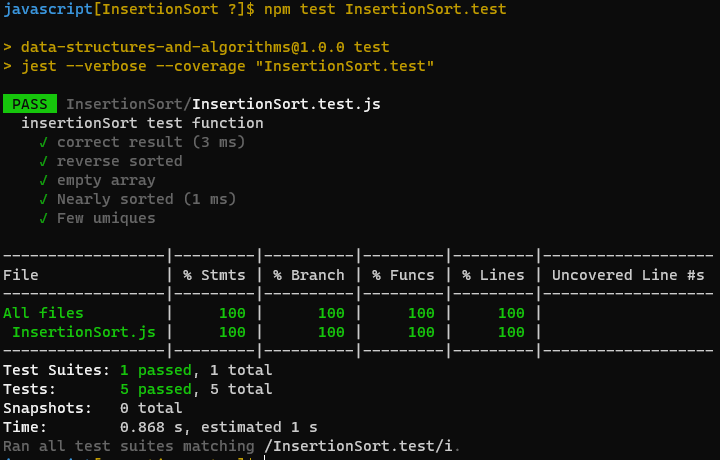

# Insertion Sort :

* Insertion sort is a simple sorting algorithm that builds the final sorted array one item at a time. 

### Challenge :

  * Provide a visual step through for each of the sample arrays based on the provided pseudo code
  * Convert the pseudo-code into working code in your language.
  * Present a complete set of working tests

### WhiteBoard : 

### The code :
[The code](https://github.com/Sukina12/401-data-structures-and-algorithms/blob/main/javascript/InsertionSort/InsertionSort.js)

### Tests :

 