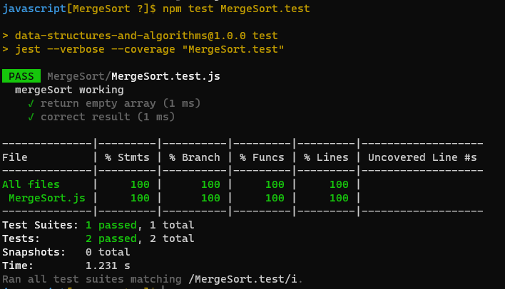

# Merge Sort :

* Merge sort is the algorithm which follows divide and conquer approach. The algorithm processes the elements in 3 steps.
  1. If A Contains 0 or 1 elements then it is already sorted, otherwise, Divide A into two sub-array of equal number of elements.
  2. Conquer means sort the two sub-arrays recursively using the merge sort.
  3. Combine the sub-arrays to form a single final sorted array maintaining the ordering of the array.

### WhiteBoard : 

### The code :
[The code](https://github.com/Sukina12/401-data-structures-and-algorithms/blob/main/javascript/MergeSort/MergeSort.js)

### Tests :

 