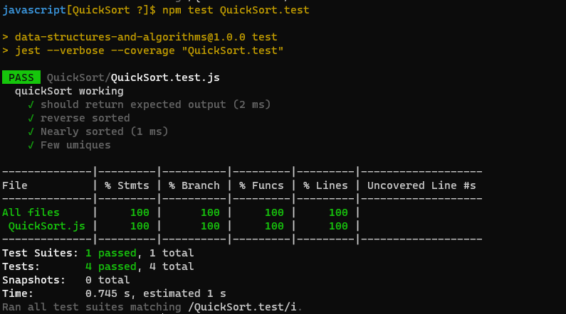

# Quick Sort :

* QuickSort is a Divide and Conquer algorithm. It picks an element as pivot and partitions the given array around the picked pivot. There are many different versions of quickSort that pick pivot in different ways.

### Challenge :

  * Write a 3 functions that take 3 arguments and return a array sorted using the quick sort algorithm.

### WhiteBoard : 

### The code :
[The code](https://github.com/Sukina12/401-data-structures-and-algorithms/blob/main/javascript/QuickSort/QuickSort.js)

### Tests :

 