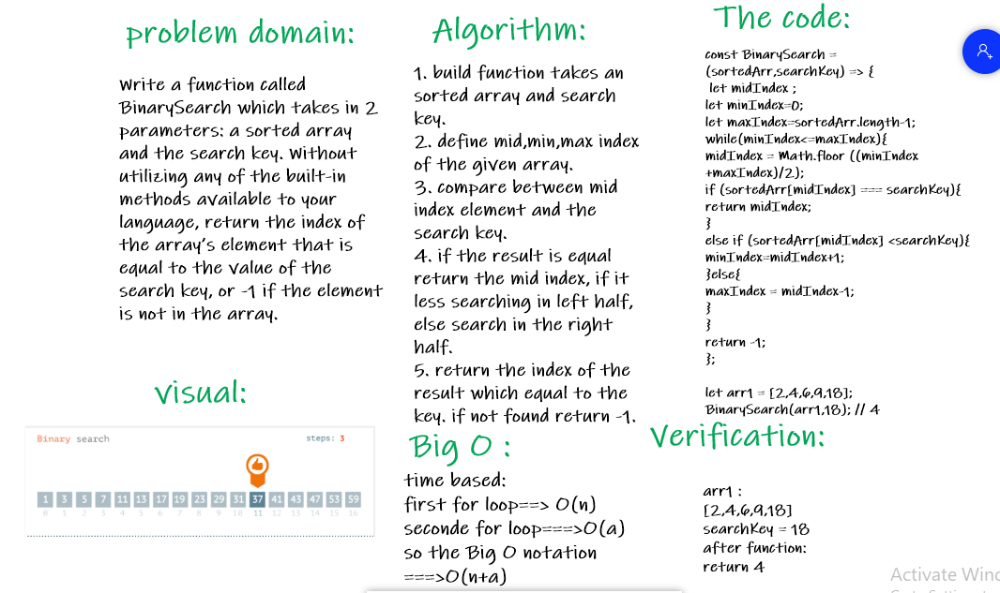

# array-binary-search 

### Write a function called BinarySearch which takes in 2 parameters: a sorted array and the search key. Without utilizing any of the built-in methods available to your language, return the index of the array’s element that is equal to the value of the search key, or -1 if the element is not in the array.

## Whiteboard Process:

## Approach & Efficiency :
1. understand the problem
2. test the challenge in replit
3. drawing the whiteboard
4. take one hour to complete