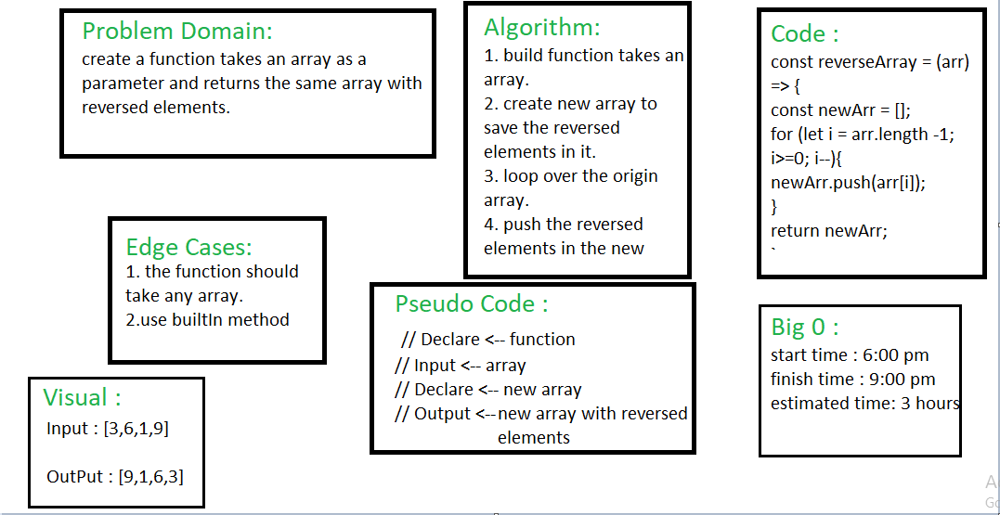

## Reverse :

* Write a function called reverseArray which takes an array as an argument and produces a new array that the same elements in inverse order.

## Whiteboard Process :

## Approach & Efficiency :

1. understand the problem 
2. test the challenge in replit
3. drawing the whiteboard
4. take 3 hours to complete