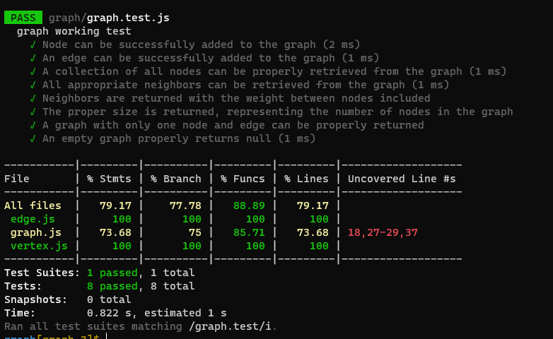

# Graphs:

## "A graph is a non-linear data structure that can be looked at as a collection of vertices (or nodes) potentially connected by line segments named edges".

### Challenge:
  * Implement a Graph. The graph should be represented as an adjacency list, and should include the following methods (add node , add edge , get nodes, get neighbors , size)
  
##### Approach 

1. I understood the problem first
2. I imagined how the results should be
3. I made a drawings of how the graph would be.
4. I wrote the code
5. I made the tests

##### Efficiency
 space : O(n)
 time :O(1)

#### API :
  * add node :
     Arguments: value
     Returns: The added node
     Add a node to the graph

  * add edge :
     Arguments: 2 nodes to be connected by the edge, weight (optional)
     Returns: nothing
     Adds a new edge between two nodes in the graph ,If specified, assign a weight to the edge ,Both nodes should already be in the Graph

  * get nodes :
     Arguments: none
     Returns all of the nodes in the graph as a collection (set, list, or similar)

  * get neighbors :
     Arguments: node
     Returns a collection of edges connected to the given node,Include the weight of the connection in the returned collection

  * size :
     Arguments: none
     Returns the total number of nodes in the graph

#### Test :

#### The Code:
[MyCode](https://github.com/Sukina12/401-data-structures-and-algorithms/blob/main/javascript/graph/graph.js)
