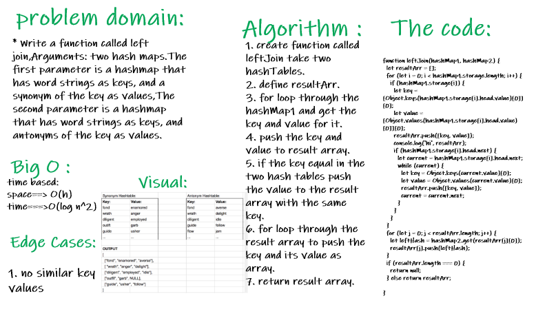
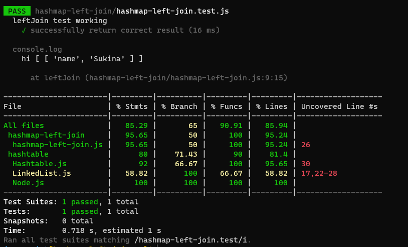

# Repeated Word:

### Challenge:
  * Write a function called left join,Arguments: two hash maps.The first parameter is a hashmap that has word strings as keys, and a synonym of the key as values,The second parameter is a hashmap that has word strings as keys, and antonyms of the key as values. Return: The returned data structure that holds the results is up to you. It doesn’t need to exactly match the output below, so long as it achieves the LEFT JOIN logic
  
##### Approach

1. I understood the problem first
2. I imagined how the results should be
3. I made a drawings of how the hashTable would be after     insertion of multiple key and values.
4. I wrote the code
5. I made the tests

##### Efficiency
 space : O(n)
 time :O(n^2)

#### WhiteBoard Process:

#### Test :

#### The Code:
[MyCode](https://github.com/Sukina12/401-data-structures-and-algorithms/blob/main/javascript/hashmap-left-join/hashmap-left-join.js)

