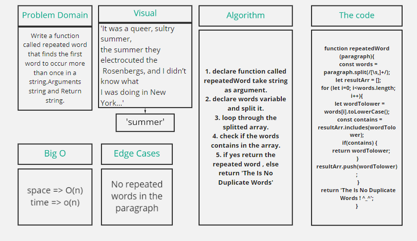
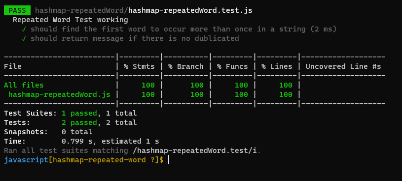

# Repeated Word:

### Challenge:
  * Write a function called repeated word that finds the first word to occur more than once in a string,Arguments string and Return string.
  
##### Approach

1. I understood the problem first
2. I imagined how the results should be
3. I made a drawings of how the hashTable would be after     insertion of multiple key and values.
4. I wrote the code
5. I made the tests

##### Efficiency
 space : O(n)
 time :O(n)

#### WhiteBoard Process:

#### Test :

#### The Code:
[MyCode](https://github.com/Sukina12/401-data-structures-and-algorithms/blob/main/javascript/hashmap-repeatedWord/hashmap-repeatedWord.js)

