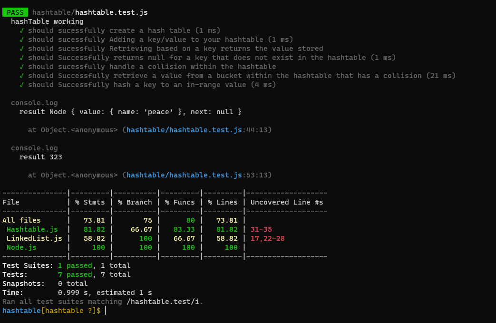

# Hash Table:

## Hashtable is an array of a list. Each list is known as a bucket. The position of the bucket is identified by calling the hash() method. A Hashtable contains values based on the key.

### Challenge:
  * create Hashtable class implements a hashtable, which maps keys to values. It inherits Dictionary class and implements the Map interface.
  
##### Approach

1. I understood the problem first
2. I imagined how the results should be
3. I made a drawings of how the hashTable would be after     insertion of multiple key and values.
4. I wrote the code
5. I made the tests

##### Efficiency
 space : O(n)
 time :O(n^2)

##### API :
  * Implement a Hashtable Class with the following methods:
    1. add(key,value): hash the key, and add the key and value pair to the table, handling collisions as needed. and return nothing.
    2. get(key): returns Value associated with that key in the table.
    3. contains(key) : Returns Boolean, indicating if the key exists in the table already.
    4. hash(key) : Returns Index in the collection for that key.

#### Test :

#### The Code:
[MyCode](https://github.com/Sukina12/401-data-structures-and-algorithms/blob/main/javascript/hashtable/Hashtable.js)

