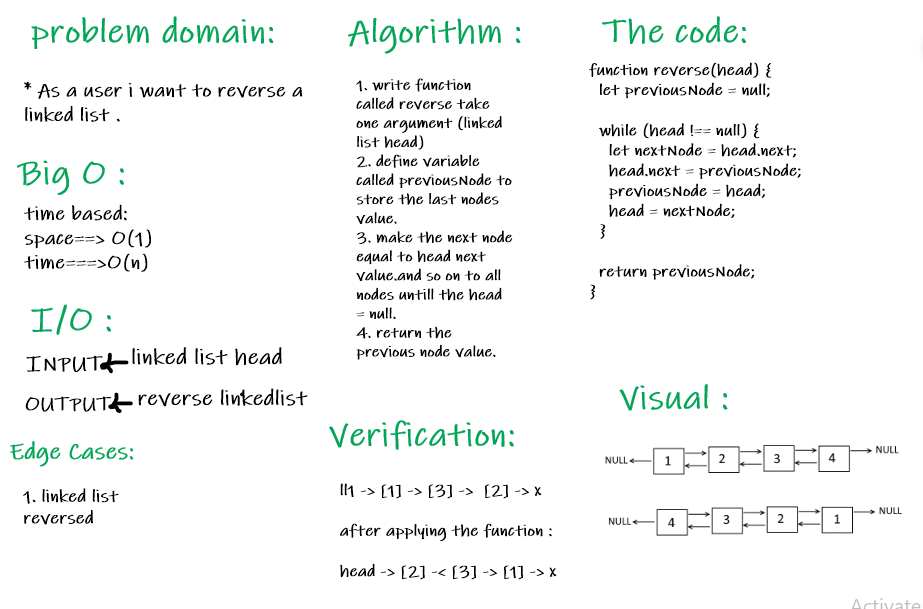

# Reverse-linked-list

### Challenge:

- write a function to reverse a Singly Linked List.

##### Approach

1. I understood the problem first
2. I imagined how the results should be
3. I made a drawings of how the linked list would be after insertion of multiple nodes Linked-List.
4. I wrote the code
5. I made the tests

##### Efficiency

Space : O(1)
Time : O(n)

#### API

* reverse(head) : take linked list head and reverse it then return the reversed linked list.

### The Code :

[The code]()

##### Test

npm run test
npm run watch

##### Whiteboard :

