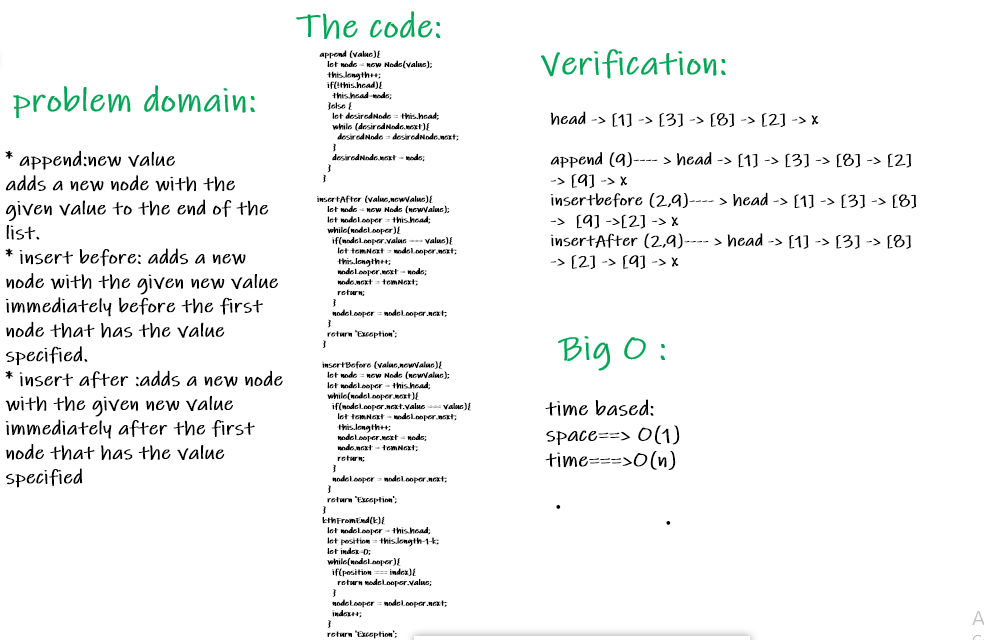

# linked-list :

### Challenge :

* create a Node class that has properties for the value stored in the Node, and a pointer to the next Node.

* Create a Linked List class with the following properties:
  * insert : Adds a new node with that value to the head of the list with an O(1) Time performance.
  * include : checks if a value in the list exist
  * toString : returns all the nodes in a list in a String format.
  *  append :  an new node with given value to the end of the list
  * insertBefore : adds a new node with give value before specified value node.
  * insertAfter : adds a new node with give value after specified value node.
  * kthFromEnd : k-th value from the end of a linked list.

* add tests to the code to test for the following:
  1. Can successfully instantiate an empty linked list
  2. Can properly insert into the linked list
  3. The head property will properly point to the first node in the linked list
  4. Can properly insert multiple nodes into the linked list
  5. Will return true when finding a value within the linked list that exists
  6. Will return false when searching for a value in the linked list that does not exist
  7. Can properly return a collection of all the values that exist in the linked list
  8. Can successfully add a node to the end of the linked list
  9. Can successfully add multiple nodes to the end of a linked list
  10. Can successfully insert a node before a node located i the middle of a linked list
  11. Can successfully insert a node before the first node of a linked list
  12. Can successfully insert after a node in the middle of the linked list
  13. Can successfully insert a node after the last node of the linked list.
  14. Where k is greater than the length of the linked list
  15. Where k and the length of the list are the same
  16. Where k is not a positive integer
  17. Where the linked list is of a size 1
  18. “Happy Path” where k is not at the end, but somewhere in the middle of the linked list

### Approach & Efficiency :

##### Approach

1. I understood the problem first
2. I imagined how the results should be
3. I made a drawings of how the linked list would be after insertion of multiple nodes Linked-List.
4. I wrote the code
5. I made the tests

##### Efficiency

* Space :
  linkedList : O(n)

* Time :
 space : O(1)
 time :O(n)

### API

* Insert(): which takes value of type any adding new node with the input value to the list.

* include(): this method compare input value if it's exist in linked list.

* toString(): return a string visiulizing the linked list shape.

* append(): appends an new node with given value to the end of the list.

* insertBefore(): adds a new node with give value before specified value node.

* insertAfter(): adds a new node with give value after specified value node.

##### How to Use
* To create an empty linked list : const  <name> = new LinkedList();
* To insert a Node at the start of the linked list : <name of linked list>.insert(<value>)
* To check for values : <name of linked list>.include(<value>) , it will return true if the value exist, otherwise it will return false.
* output all of the values of the linked list : <name of linked list>.toString()

### The Code :

[code](https://github.com/Sukina12/401-data-structures-and-algorithms/blob/main/javascript/linked-list/LinkedList.js)
##### Test
npm run test
npm run watch

### WhiteBoard :

