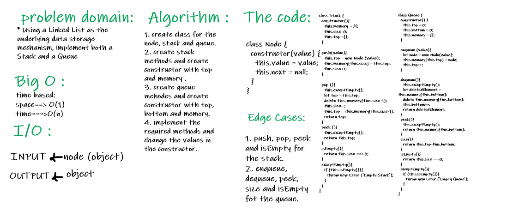

# Stack and Queue :

### Challenge : 

   * Using a Linked List as the underlying data storage mechanism, implement both a Stack and a Queue

### Approach and Efficiency :

  * space : O(1)
  * time : O(n)

### API :

   #### Stack :
    * push()
    * pop()
    * peek()
    * size()
    * isEmpty()
   #### Queue :
     * enqueue()
     * dequeue()
     * peek()
     * size()
     * isEmpty()

### WhiteBoard : 

