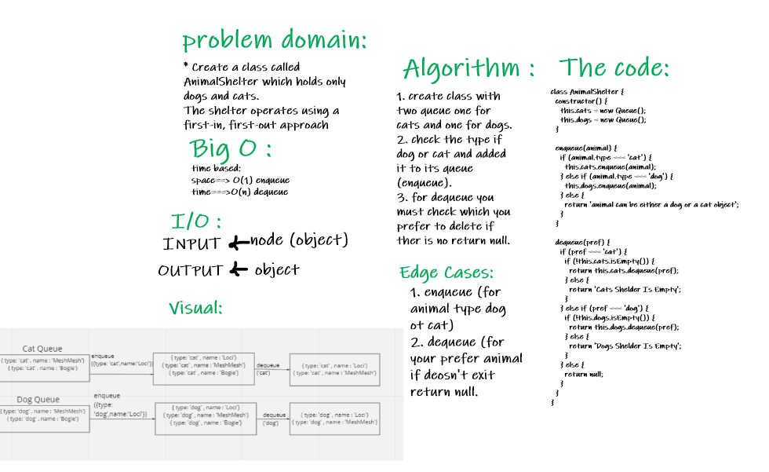
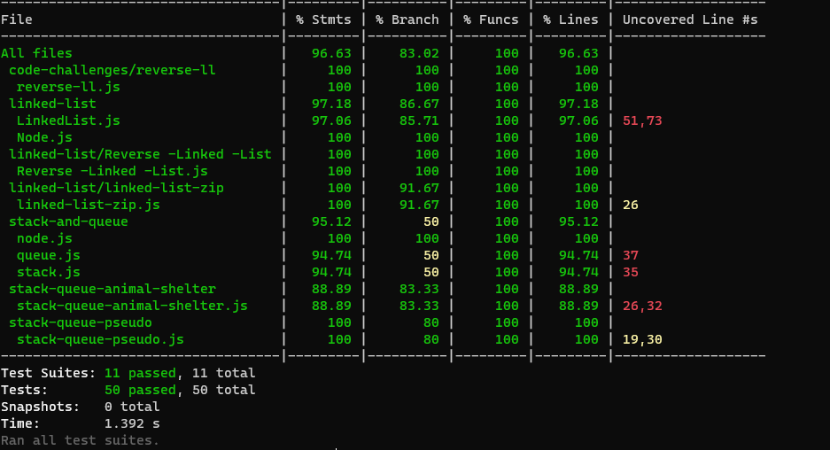

# stack-queue-animal-shelter  :

### Challenge : 

   * Create a class called AnimalShelter which holds only dogs and cats.
     The shelter operates using a first-in, first-out approach

### Approach and Efficiency :

  * space : O(1) 
  * time : O(n)

### API :
    * enqueue 
    * dequeue

### WhiteBoard : 

### The code :
[The code](https://github.com/Sukina12/401-data-structures-and-algorithms/blob/main/javascript/stack-queue-animal-shelter/stack-queue-animal-shelter.js)

### Tests :

