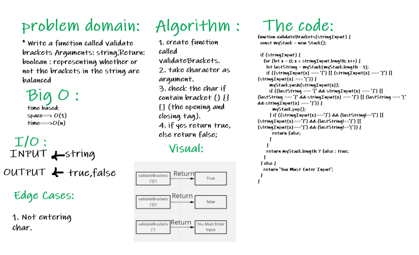
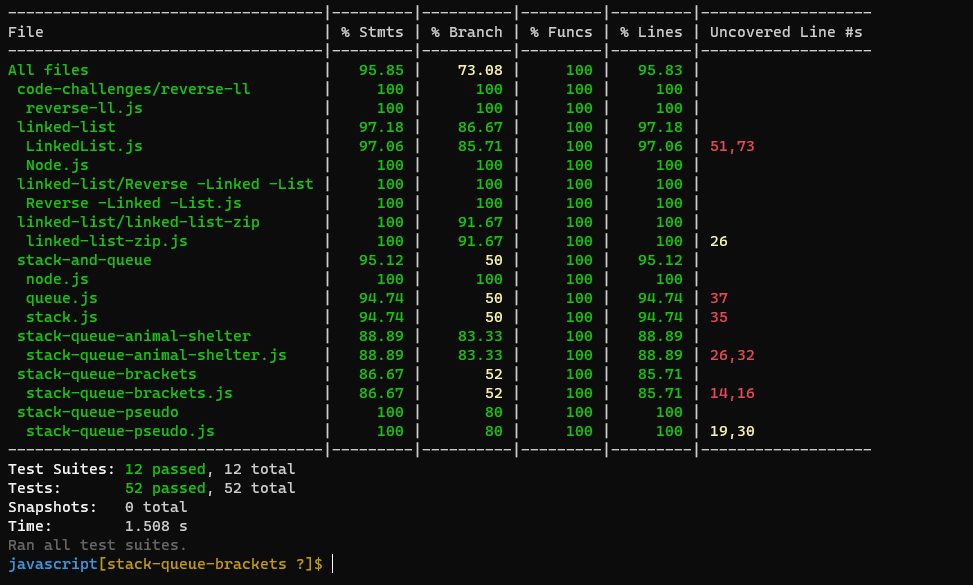

# Strack-Queue-Brackets :

### Challenge : 

   * Write a function called validate brackets ,Arguments: string ,Return: boolean
     representing whether or not the brackets in the string are balanced

### Approach and Efficiency :

  * space : O(1)
  * time : O(n)

### API :

 * validateBrackets (stringInput) : return if the stringInput have brackets.

### WhiteBoard : 

### The code :
[The code](https://github.com/Sukina12/401-data-structures-and-algorithms/blob/main/javascript/stack-queue-brackets/stack-queue-brackets.js)

### Tests :

