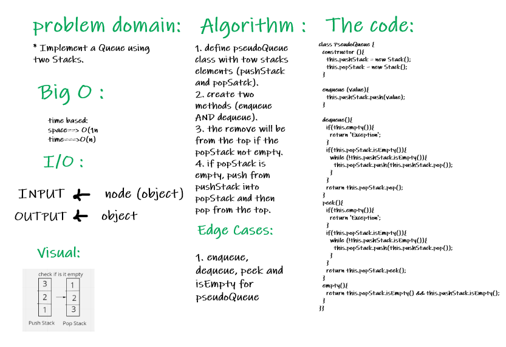
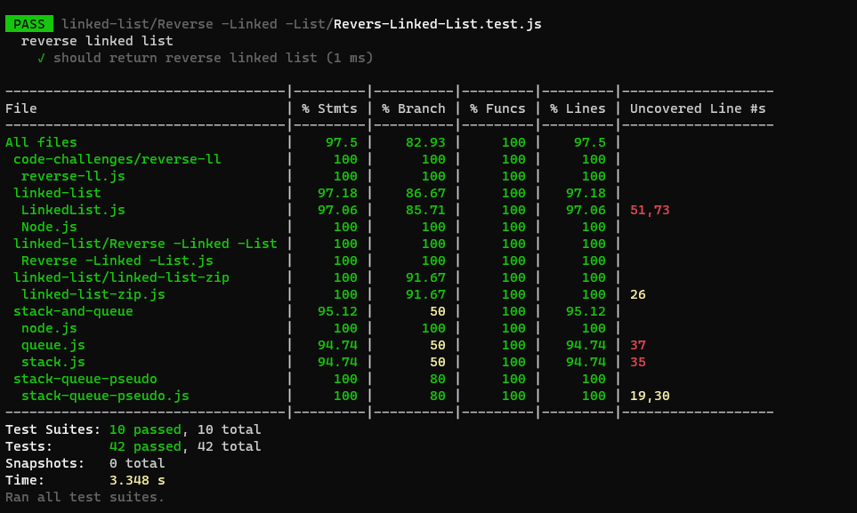

# Queue With Stack :

### Challenge : 

   * Implement a Queue using two Stacks.

### Approach and Efficiency :

  * space : O(n)
  * time : O(n)

### API :

   #### Stack :
    * push()
    * pop()
    * peek()
    * size()
    * isEmpty()
   #### Queue :
     * enqueue()
     * dequeue()
     * peek()
     * size()
     * isEmpty()

### WhiteBoard : 

### The code :
[The code](https://github.com/Sukina12/401-data-structures-and-algorithms/blob/main/javascript/stack-queue-pseudo/stack-queue-pseudo.js)

### Tests :

