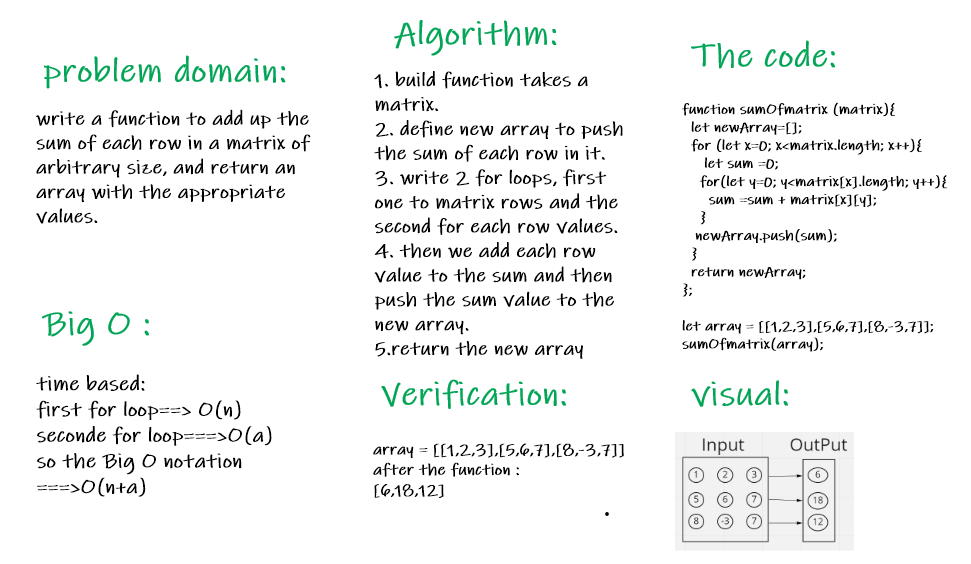

# Sum-Matrix

### write a function to add up the sum of each row in a matrix of arbitrary size, and return an array with the appropriate values.

## Whiteboard Process:

## Approach & Efficiency :
1. understand the problem
2. test the challenge in replit
3. drawing the whiteboard
4. take one hour to complete