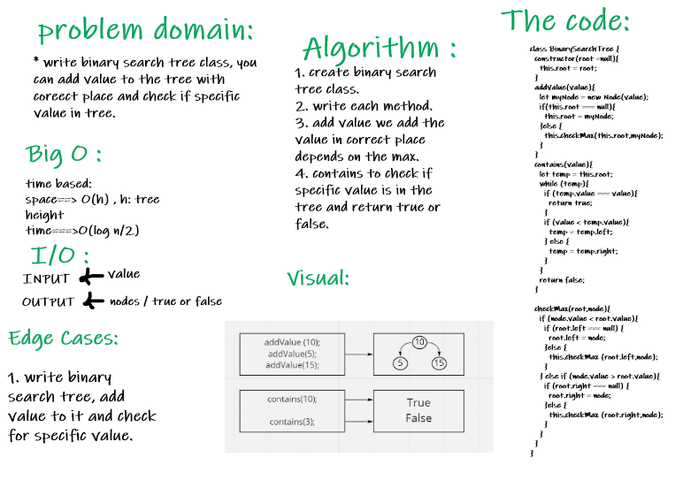

# Trees : Binary Tree & Binary Search Tree :

### Challenge :

* Write Binary and Binary Search trees class with their methods.

### Approach & Efficiency :
  
  * space : O(h) , h: tree height
  * Time : O (log n/2)

### API :

##### Binary Tree :

  * preOder() : Root -> Left -> Right
  * postOrder() : Left -> Right -> Root
  * inPrder() : Left -> Root -> Right
  * maxValueFinder(): return max value in the tree
  * breadthFirst(): return list of all values in the tree, in the order they were encountered

##### Binary Search Tree:

  * addValue(value) : add value to the tree
  * contains(value) : check if the tree contains this value at least one time.
  * chackMax : check the max value before adding to the tree to determine where must it be.

### Whiteboard :
 
  * Binary Tree WhiteBoard:
  

  * Binary Search Tree WhiteBoard:
  

  * Binary Tree maxValue Function :
  

  * tree-breadth-first :
  

### Tests :

