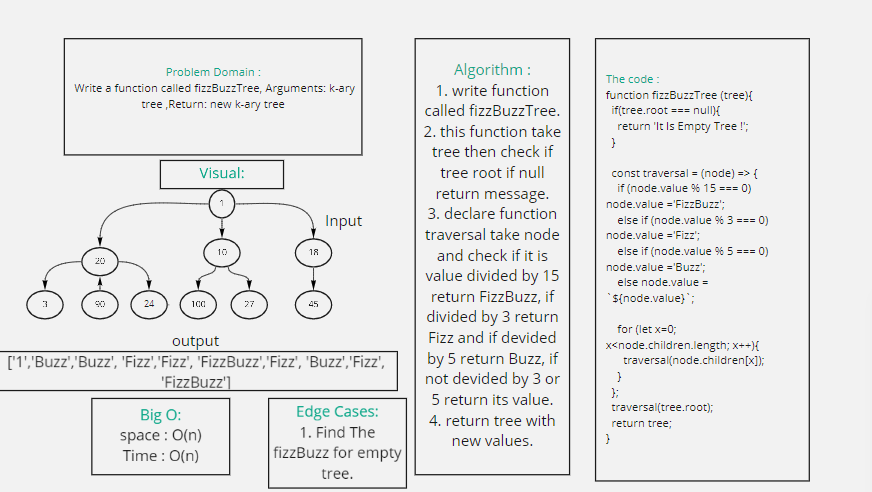
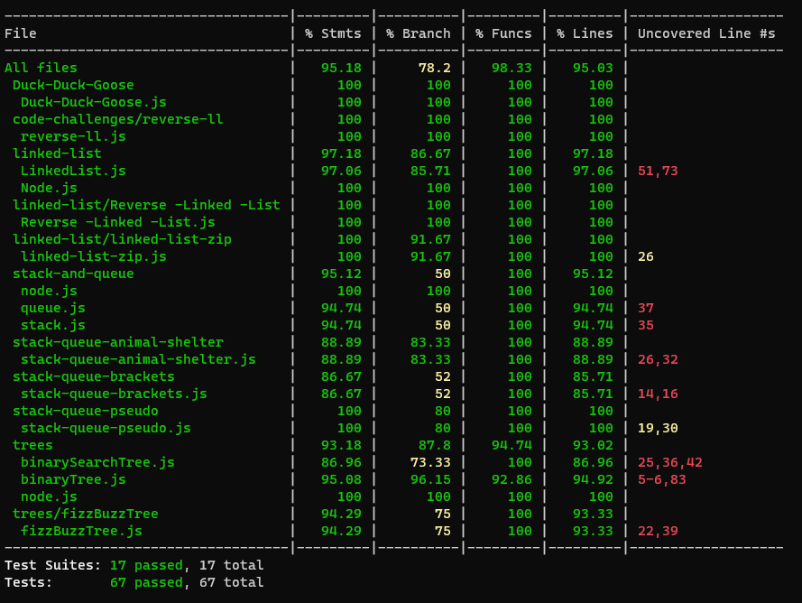

# Trees : FizzBuzzTree 

### Challenge :

* Write a function called fizz buzz tree, Arguments: k-ary tree ,Return: new k-ary tree

### Approach & Efficiency :
  
  * space : O(n) 
  * Time : O(n)

### API :

##### Kary Tree :
  * breadthFirst(): return list of all values in the tree, in the order they were encountered.
  * fizzBuzzTree (tree) : return new tree with Buzz or Fizz or FizzBuzz or its value.

### Whiteboard :
 
  * fizzBuzzTree:
  

### Tests :

